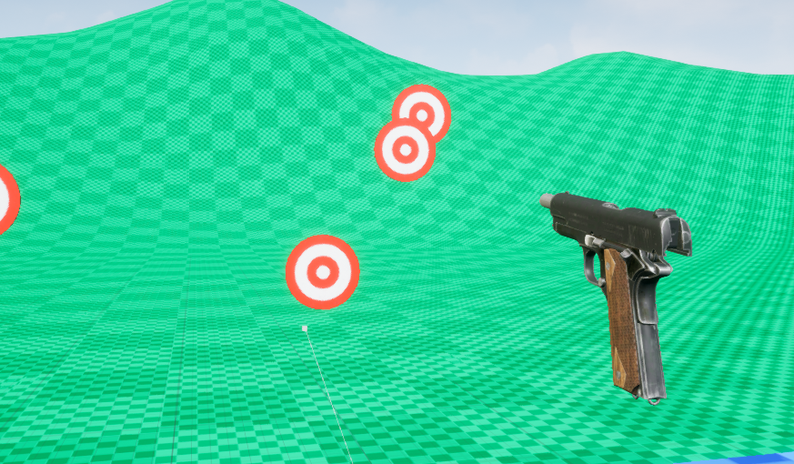

# VRTemplate 2.0

Overview:

An improvement on the hand and player classes from version one of my virtual reality template found at the following link:

https://github.com/Lewisscrivens/VRTemplate

I also removed/improved code where nessasary such as the rotatable class supporting a wider range of different movements and the grabbable class 
which has been simplified to only use physics grabbing as the hand was changed to be physics based also.

NOTE: The template was developed using Unreal Engine 4.25 with the Valve index and SteamVR.

Refferences:

Colt 3D Model - https://sketchfab.com/3d-models/colt-1911-3e2bd907e96a4f49a297780e36315cf2

Go-Kart Model - https://sketchfab.com/3d-models/go-kart-db54b705c0e546229fb43c55d7e7ad3f

----------------------------------------------------------------------------------

NOTE: Click the image bellow to find a video of the results of this template.

